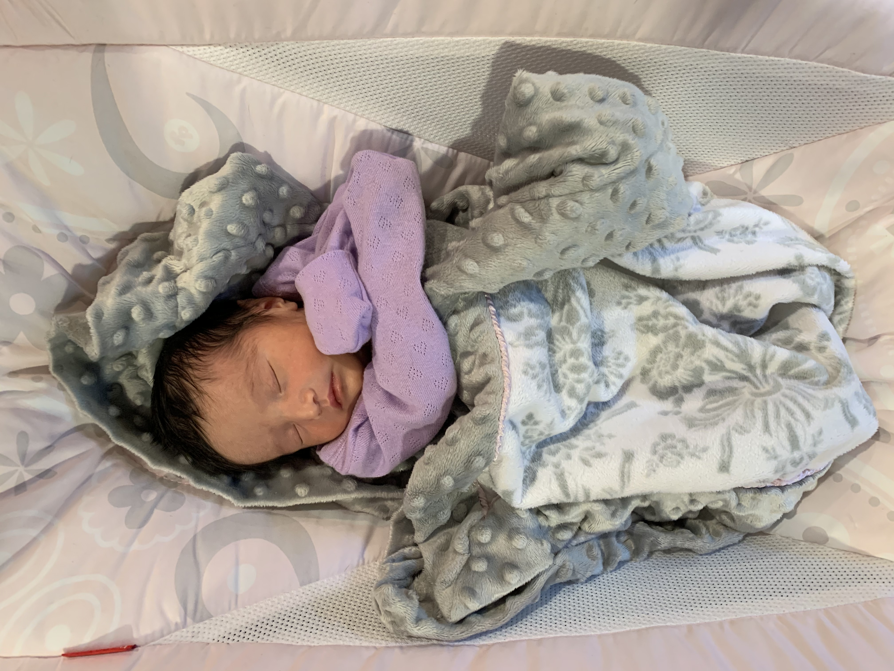
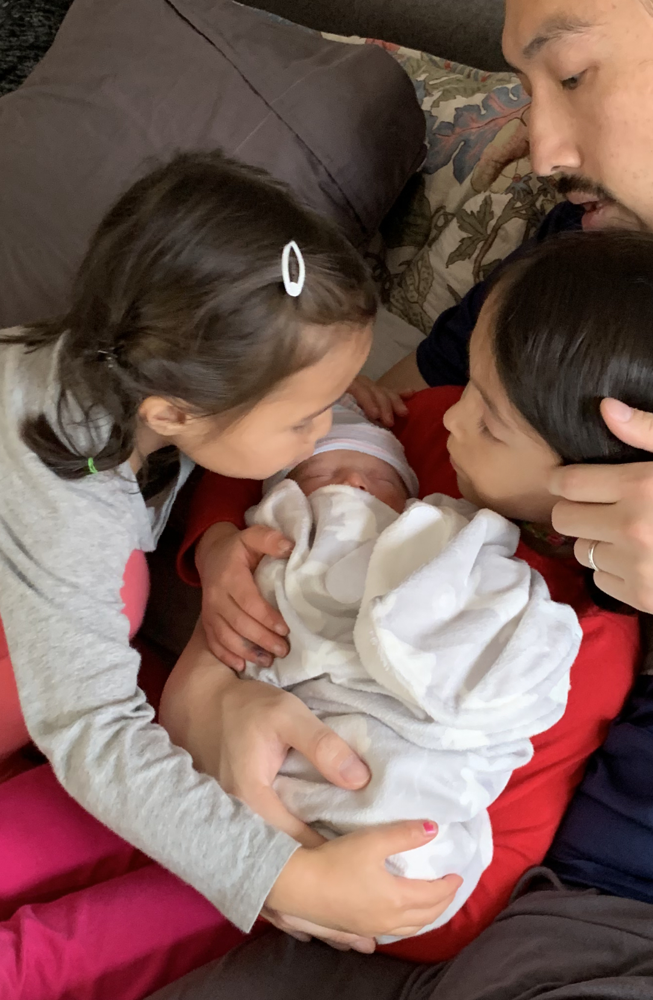
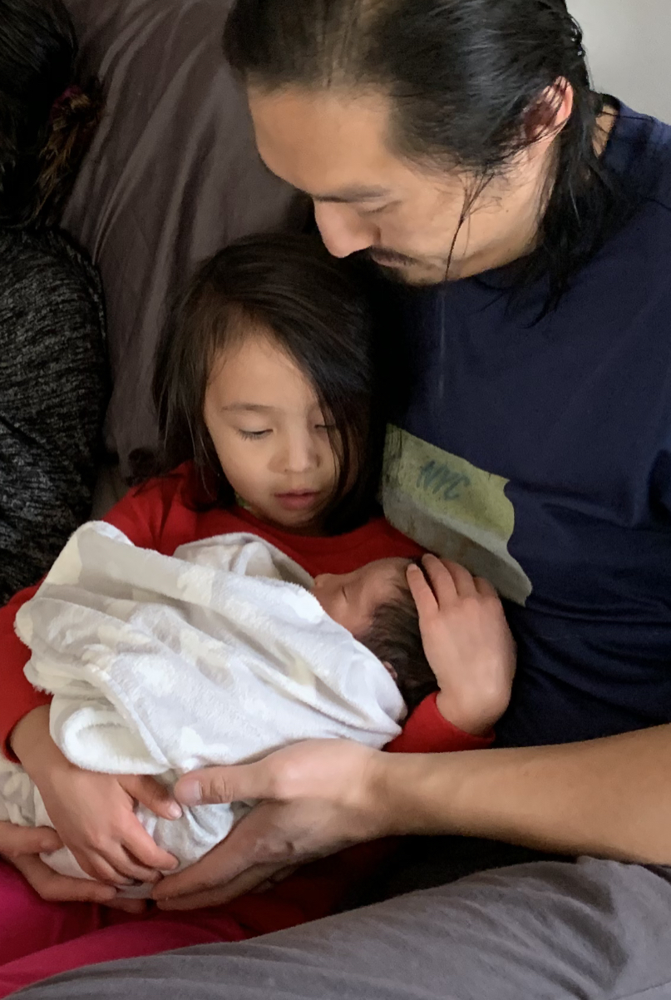
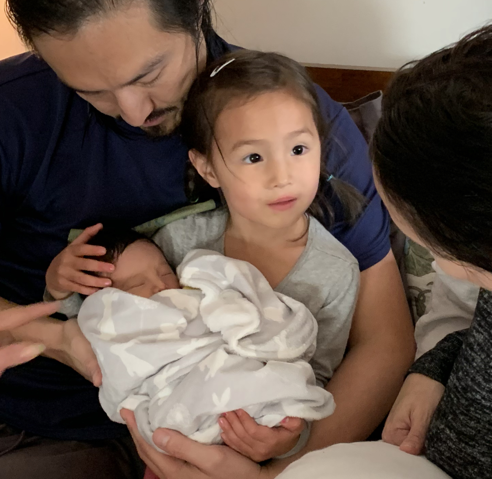

# This is Jerry Chao's website

Welcome to my website.  I am a pediatric anesthesiologist and clinical researcher at Albert Einstein College of Medicine, Montefiore Medical Center studying the neuroscience of early anesthesia.

## A new addition to our family

My wife and I welcomed our third child, Violet Ruth Chao, born on October 28, 2020.  

Big sisters Olive and Marigold are smitten!

Olive is a great big sister - already cuddling Violet super carefully

That look on Marigold's face!

# Links to other websites

Here are some links to other websites about me:

* [Montefiore faculty page](https://www.montefiore.org/body.cfm?id=4148&action=detail&ref=3900)
* [Children's Hospital faculty page](https://www.cham.org/patients-families/find-a-doctor/jerry-y-chao-md-11118634)
* [Elsevier Pure](https://einstein.pure.elsevier.com/en/persons/jerry-y-chao)
* [twitter](https://twitter.com/JerryChaoMD)

# Link to page within the site

[About me](about.html)